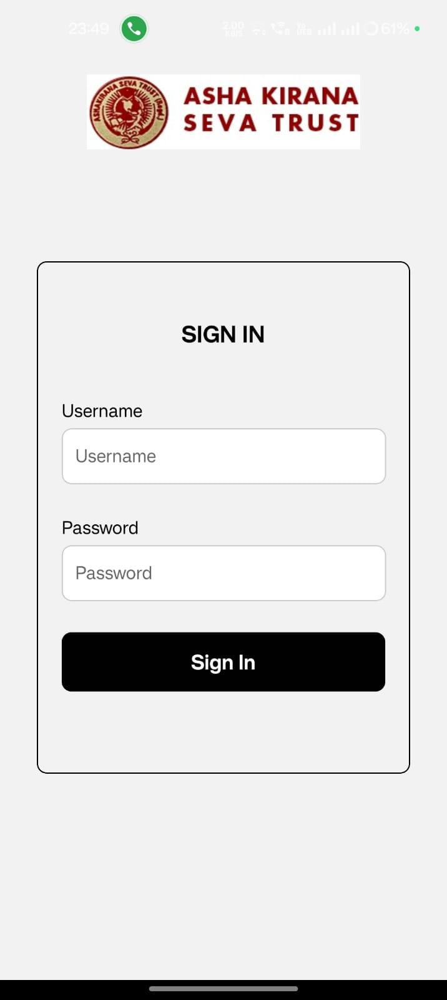
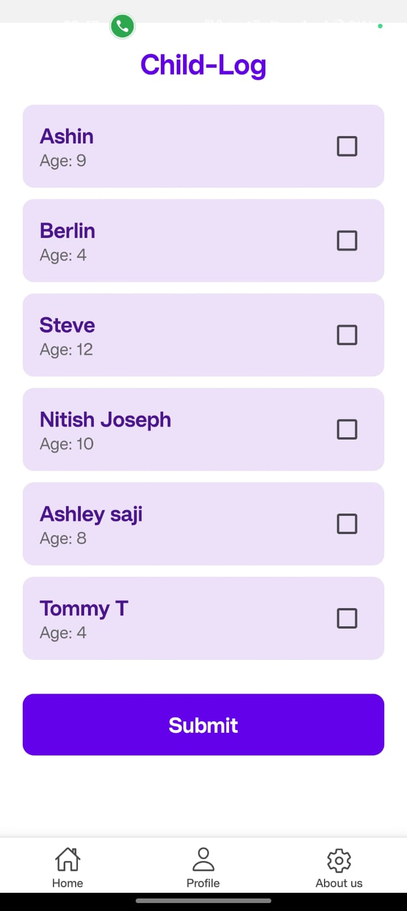
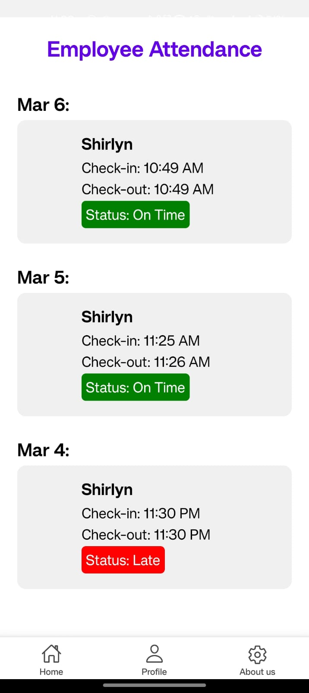
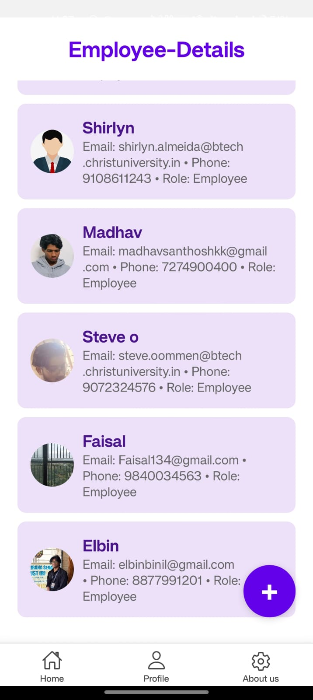
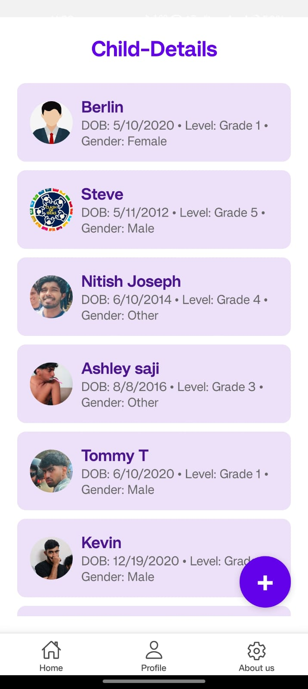
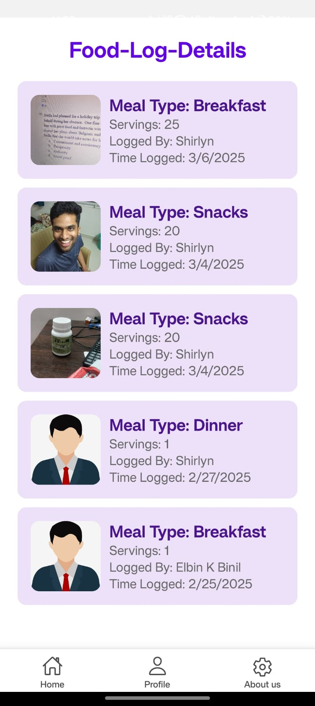
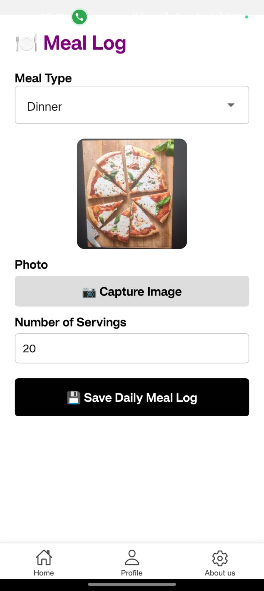

# 🌟 CareNest – Smart Orphanage Management System

CareNest is a comprehensive orphanage management solution designed to digitize and enhance the day-to-day operations of child care institutions. The platform offers modules for secure login, attendance tracking, real-time monitoring of children and employees, and a unique **food vlogging** feature that promotes transparency in nutrition management.

<p  align="center">


</p>

---

## ⚒️ Releases

- [Carenest v1.0](https://github.com/ElbinBinil/carenest-frontend/releases/tag/v1.0)

## 📱 Key Features

- 🔐 **Role-Based Login System**

- Separate login portals for Admin and Employees

- Secure authentication with session management

- 🧒👩‍🏫 **Attendance Tracking**

- Daily and monthly report generation

- 🍱 **Food Vlogging**

- Upload meal images and logs

- Ensures food quality and meal transparency

---

## 🏗️ Tech Stack

| Component | Technology |

|----------------|---------------------------|

| Frontend | React Native |

| Backend | BackBlaze storage | Node.js |

| Database | Firebase Firestore / MongoDB |

| Authentication | Admin Auth / JWT |

---

## 🖼️ Screenshots

> 📸 Add actual screenshots of your app in the `/screenshots` folder and replace the image paths below.

### 🔐 Login Interface



### 📅 Attendance Dashboard



### 🎥 Monitoring Panel






### 🍽️ Food Vlogging



## 🚀 Getting Started

### Prerequisites

- React Native Expo CLI
- API

### Installation

# Clone the repo

```
git clone https://github.com/yourusername/carenest.git
cd carenest
```

# Install dependencies (choose one depending on stack)

`npm install`

# React Native (using Expo)

`expo start`

## 📌 Future Enhancements

- Predictive analytics for child health using ML

- Blockchain for secure data records

- Admin dashboard with charts and trends

- Integration with SMS/email for alerts

- Multi-language UI support

---

## 🤝 Contributing

We welcome contributions! Please fork the repository, make your changes, and submit a pull request. You can also open issues for bug reports or feature requests.

---

## 🧠 Inspiration & Vision

CareNest was built to address the gaps in traditional orphanage and childcare center management. It empowers institutions to offer structured care, transparency, and efficiency. The project aligns with:

- 📌 **UN SDG 3** – Good Health and Well-being

- 📌 **UN SDG 4** – Quality Education

- 📌 **UN SDG 16** – Peace, Justice, and Strong Institutions

---

## 📫 Contact

**Elbin K Binil**

📧 [elbinbinil@gmail.com](mailto:elbinbinil@gmail.com)

🔗 [LinkedIn](https://linkedin.com/in/elbinbinil)

📌 [GitHub](https://github.com/elbinbinil)

---

> ⭐ If you found this project useful or inspiring, give it a star!
